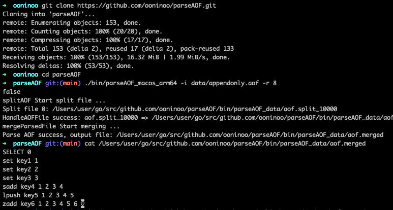

## 目录
- [目录](#目录)
- [1、介绍](#1介绍)
  - [(1) 特性](#1-特性)
  - [(2) 架构](#2-架构)
  - [(3) 原理](#3-原理)
- [2、编译](#2编译)
- [3、使用](#3使用)
  - [(1) 输入文件](#1-输入文件)
  - [(2) 输出文件](#2-输出文件)
  - [(3) 使用示例](#3-使用示例)
- [4、性能\</span](#4性能span)
  - [(1) 测试](#1-测试)

## 1、介绍
parseAOF是一个简单快速的解析Redis AOF文件的工具

### (1) 特性

- 代码简洁并且易于定制化
- 通过多协程加速解析AOF文件
- 解析后会生成命令列表，可用于日志查询等

### (2) 架构


### (3) 原理
关于项目的相关原理可以参考[这篇文章](https://github.com/WGrape/Blog/issues/11)

## 2、编译

```bash
git clone https://github.com/WGrape/parseAOF
cd parseAOF
go mod download
make build
```
## 3、使用
运行位于`bin`目录下的parseAOF二进制，并制定输入的AOF文件路径

```bash
./bin/parseAOF_macos_arm64 -i ~/Download/appendonly.aof -r 8
./bin/parseAOF_macos_arm64 -h
parse redis aof to readable

Usage:
  parseAOF [flags]

Flags:
  -h, --help            help for parseAOF
  -i, --input string    input AOF file path
  -o, --output string   output dir path
  -r, --routines int    max goroutines (default 8)
```

### (1) 输入文件
> 为了便于测试，可以使用 [./data/appendonly.aof](./data/appendonly.aof) 这个示例输入文件

开始执行前，传递AOF文件路径参数给 ```start.sh``` 脚本, AOF文件内容如下所示

```text
*2
$6
SELECT
$1
0
... ...
```

### (2) 输出文件
> 为了便于测试，可以使用 [./data/aof.merged](./data/aof.merged) 这个示例输出文件

解析完成后，会在 ```data``` 目录下生成 [aof.merged](./data/aof.merged) 文件，其内容如下所示

```text
--------------------parseAOF | version=0.5.0--------------------
SELECT 0 
set key1 1 
set key2 2 
set key3 3 
sadd key4 1 2 3 4 
lpush key5 1 2 3 4 5 
zadd key6 1 2 3 4 5 6 
```

### (3) 使用示例



## 4、性能</span

- 平均以 ```50000行/s``` 的速度解析AOF文件

### <span id="51">(1) 测试</span>

| Id | Lines | Size | Cost | CPU |
| --- | :----:  | :---: | :---: | :---: |
| 1 | 1,2301,117 | 39MB | 3m50s | <=65% |
| 2 | 3,435,263 | 13MB | 1m12s | <=65% |
| 3 | 357,850 | 8.6MB | 3.47s | <=113% |
